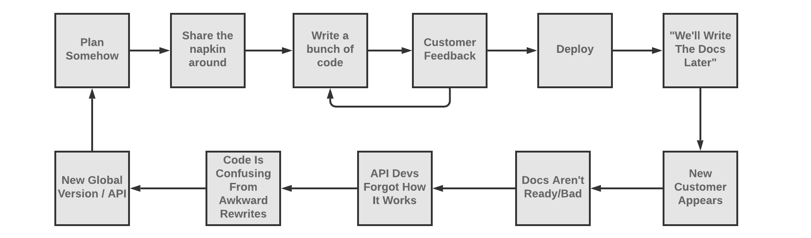
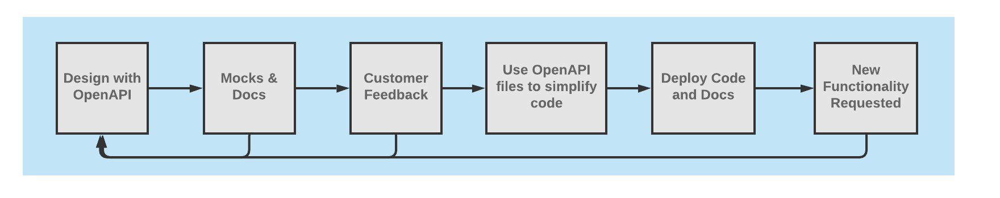

With API descriptions rising in popularity, the main question I hear folks
asking about is "API Design-first" or "code-first". This is a bit of a
misleading question because these are not two unique things, there are a few
variants. 

## Code-First, Write Docs "When We Have Time" 



This is how I came into contact with API description documents like OpenAPI or
API Blueprint in the first place, and it is how our first book suggested API
developers do things. This may have made sense at the time, but I quickly
discovered it to be an immature workflow.

One issue here is that "code-first and meh docs later" treats API descriptions
like a fancy way of making API reference documentation, which is one of 100
things API descriptions can do. API descriptions are machine readable files with
a plethora of data and metadata, which can used to gather feedback from early
stages to improve the quality of the API before it's even written through
[mocking](https://stoplight.io/prism/), offer [client-side
validation](/blog/the-many-amazing-uses-of-json-schema-client-side-validation)
and [server-side
validation](/blog/server-side-validation-with-api-descriptions/). 

Writing a bunch of code first, deploying the thing, getting clients onboarded
with special hands-on treatment, etc. is a whole lot of work. When this whole
phase is done, spending a month writing up documentation which will "only get
out of date" can feel like a giant chore, one that most businesses struggle to
prioritize so the task just never gets done. 

This was the excuse I heard regularly for why WeWork, a company with ~50
engineers in 2016 managed to build ~30 APIs with zero documentation at any
point. The lack of documentation lead to some of the most bonkers
time-and-money-wasting I've ever come across, with folks building out [new
versions of endpoints and APIs](/blog/api-versioning-has-no-right-way/) because
nobody could remember how the code worked. Even reading the code was almost
impossible due to API A dynamically returning mushed together chunks of JSON
from API B and API C [without any serializers
involved](https://phil.tech/api/2015/05/30/serializing-api-output/). 

"We'll write documentation later" means "We will not write documentation", and
by the time you discover you need it, it'll be too late. On the off-chance you
are one of the few who get it done quickly, keeping these documents "in sync"
with the code is the biggest problem most developers faced. At my talk on this
subject at [API the Docs](https://apithedocs.org/amsterdam2019), the entire room
of ~80-100 people put their hand up when I asked "Who here struggles with
keeping code and docs in sync"? 

There are [a few approaches](/blog/keeping-documentation-honest), but even if
you absolutely nail using [Dredd](https://dredd.org/) or similar tooling to keep
things synced up, there is the other rather large problem we've not covered yet:
the fact that you built the whole API before giving your customers a chance to
play with it. 

[Mocking](https://stoplight.io/mocking/) is too often overlooked, and people
waste time and money building out nonsense APIs which don't help their
customers. This usually means a v2 comes quickly after the v1, and maybe a v3 is
required as a few more clients get involved and give more feedback. This usually
means the API was too normalized, leading to the client needing to make 150 HTTP
requests to solve their use case, or the resources are giant meaning there is
good data hidden amongst 100 fields the user didn't need. 

[Use-case driven
APIs](https://medium.com/@__xuorig__/the-tension-between-data-use-case-driven-graphql-apis-8f982198653b)
are usually way more useful than data-driven APIs, regardless of the API
[paradigm you picked](/blog/picking-the-right-api-paradigm/) for the API build.
Let your users share their feedback early, when it's still cheap and easy to
change things - not when it's already in production and change gets more
complex.

## Code-First, then Annotate


This popular variation of the code-first approach to API descriptions the effort
to speed up the "documentation later" part of the process, a lot of API
developers decide to use annotations or code comments to litter their source
code with bits of the API description in a special format.

Multiple tools exist for this. In some strictly typed languages the annotation
tooling contains very little information, mostly only things like human-readable
descriptions. Information like basic types ("string" and "integer") can be
inferred from the code, wether null is allowed, etc. can all be picked up. Sadly
some people think that is all the information they need to put into a
description document. They ignore things like example values, formats like
"email" or "date-time" which can add validation benefits and make documentation
more useful, and other more advanced features in OpenAPI or JSON Schema like
allOf, oneOf, etc. 

Languages with annotations as a first class feature generally support this a bit
better, like Java. They have a multitude of annotation systems which can give
you syntax errors if you write rubbish in there.

```java
class UserController {
  @OpenApi(
      path = "/users",
      method = HttpMethod.POST,
      // ...
  )
  public static void createUser(Context ctx) {
      // ...
  }
}
```

Other languages like PHP rely on doc block comments, and that's just writing
nonsense into a text editor. 

```php
/**
  * @OA\Get(path="/2.0/users/{username}",
  *   operationId="getUserByName",
  *   @OA\Parameter(name="username",
  *     in="path",
  *     required=true,
  *     description=Explaining all about the username parameter
  *     @OA\Schema(type="string")
  *   ),
  *   @OA\Response(response="200",
  *     description="The User",
  *     @OA\JsonContent(ref="#/components/schemas/user"),
  *     @OA\Link(link="userRepositories", ref="#/components/links/UserRepositories")
  *   )
  * )
  */
public function getUserByName($username, $newparam)
{
}
```

This looks rough to me, but folks defend it with reasoning like: "having the
annotations near the code means developers are more likely to keep it up to
date". More likely is not definitely.


Using annotations you still need to use one of the approaches to making sure
code and descriptions are in sync, but you have to add a build step to export
from source code and then run that generated OpenAPI file through Dredd or
similar. Or you can just hope that all of your developers remember and "it'll be
fine".

The feedback loop here is still a bit long. It comes after you've written a
whole bunch of code, or maybe you wrote all the routes to a bunch of empty
controllers, and can export the OpenAPI to create a mock server, but that all
still sounds like a lot of work. There are more improvements to be made.

## Design First, Ditch for Code First


In general, "API Design First" is about closing the feedback loop substantially.
You get mocks and docs before you write any code, so there is no more mucking
about with code until a decent number of clients have confirmed the interfaces
look good for their needs, and seeing as you already have what you need to
generate docs you don't have to worry about doing it later. 

This specific flavour of design-first still has a lot of problems, yet recently
a few big names in the API world have been advocating for this. Mainly I think
they advocate for it because they are sick of writing API descriptions by hand:
insert the usual complaints about "thousands of lines of YAML" here. Maybe they
use a DSL to design things at first, then switch to annotations once things are
done, again hoping "it will be more likely to stay up to date" that way.

One of multiple falsehoods here is the idea that there is a design phase, then
you stop designing things and it's time for the code to happen, and we don't
need to do design new functionality after that. 

Regardless of whether devs write the API code by hand or generate it from API
descriptions, there is no end to the design phase. Design is a circular
life-cycle with a feedback loop which leads to new resources and endpoints, or
new global versions, or just new properties. APIs evolve over time, and rolling
out new functionality without gathering feedback from customers is always a bad
idea, not just in the initial design phase. 

I have seen some success from folks at [Meetup](https://meetup.com/) using
"immutable services", where they generate routes, controllers, data models,
docker config, even all the Kubernetes setup, all from OpenAPI, then they just
slap in a bit of business logic in the empty gaps and hit deploy. What happens
when they need to make changes to the contract? That'll be a brand new service.
No change allowed. Plan things well enough you don't need to tweak em for ages,
then deprecate and replace them if change is required. Immutable services are
not a common way to do things, and require a huge amount of discipline to get
right. 

For everyone else, evolution is more common, because even folks using major
global versions for their API will make backwards compatible changes as they go
(new endpoints, etc.) Tooling which asks you to "Import" OpenAPI then go on from
there without it is condemning you to a design-less future for new
functionality, even if they offer an Export OpenAPI feature (which many don't).

Worse than that, many of these tools keep their own version of your API
description in the cloud, which can change independently of the API description
you have in your Git repo, meaning you don't a sources of truth: _you have two
sources of lies._

Let's look at a workflow which allows you to use API descriptions as a single
source of truth, which evolves along with your code.

## Design-First, Evolve with Code



This approach stops treating API description documents like an afterthought, or
like a chore, because they aren't. DSL's might have been required to [make
writing OpenAPI
bearable](https://developer.squareup.com/blog/making-openapi-swagger-bearable-with-your-own-dsl/)
in the past, but with stunning visual editors like [Stoplight
Studio](https://stoplight.io/studio/), the days of using DSLs as a crutch to
avoid hand-rolling YAML are behind us. Studio lets you work with your OpenAPI
files on your local machine, for free, so anyone can easily build up powerful
description documents, and even easily reuse models between multiple APIs so the
whole "thousand lines of YAML" thing completely falls away.

Whether you use Studio, DSL, or write it by hand, start off in your empty repo
with just the description documents. Run a mock server early and often, get
feedback from your customers, then commit the documents once things are agreed.

Then you can start writing code. The amount of code you need to write can be
drastically simplified with tooling that uses your description documents to
power [server-side
validation](/blog/server-side-validation-with-api-descriptions/), or even API
Gateway validation.

This is not code generation, but it is using your API descriptions to power
production validation. The same description documents that you are using to
render documentation are now powering the most complex aspect of your API, and
things can never be "out of sync" because there is only one source of truth. 

When customers request new functionality, it is easy to add new endpoints,
introduce new properties, etc., and get feedback on that new stuff before you
start writing the code. At no point do you lose that ability, so you can benefit
from design first, design again, and again. 

This does not help keep responses "in sync", but seeing as your description
documents are sat right there in your repo, you can use them to [drastically
simplify your unit/integration
testing](/blog/writing-documentation-via-contract-testing) anyway, so the whole
interface is covered. 

Don't half-ass your description documents. Use them to plan something amazing,
and cut down the amount of recoding you need to do down the line. Create APIs
which last longer, which are better documented, better tested, all whilst
reducing the total amount of time spent developing the API overall.
