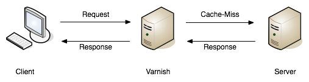

Recently I wrote [GraphQL vs REST: Overview](https://blog.apisyouwonthate.com/api/2017/01/24/graphql-vs-rest-overview/), giving a hype-free outline of the differences between [REST](https://en.wikipedia.org/wiki/Representational_state_transfer) and [GraphQL](http://graphql.org/). One section that would not have fit into that already lengthy article was caching, so I thought I'd cover this on its own.

Comparing how caching is used for the two approaches is tricky, because despite common opinion, REST has nothing to do with HTTP. REST is _usually_ implemented in HTTP, therefore when most folks talk about ["caching in REST"](http://www.apiacademy.co/how-to-http-caching-for-restful-hypermedia-apis/), they are really talking about caching with HTTP. That is a [huge topic in its own right](https://www.mnot.net/cache_docs/).

Another point to mention is that caching for HTTP-based REST, or HTTP-based RPC, is pretty much the same. In the wild I notice RPC APIs offer caching far less, but for the sake of argument let's ignore this separation and describe them both as "endpoint-based APIs"; a term used by the GraphQL folks to differentiate APIs able to leverage the entirety [of HTTP caching](https://tools.ietf.org/html/rfc7234) to their advantage, from GraphQL APIs which usually just use HTTP as a "dumb" tunnel.

Let's have a quick look at the different types of caching that can be involved in an endpoint-based API:

**Client Caching:** Also referred to as "browser caching", the client, browser, app, other service, etc. downloading the data can keep track of what was downloaded when, if that data had any expire time, ETags for the last request to allow for conditional request if data has changed, etc.

**Network Caching:** Tools like [Varnish](https://www.varnish-cache.org/) or [Squid](http://www.squid-cache.org/) intercept requests that look the same (based on various configurable criteria), returning a response early straight out of memory, instead of hitting the application server. This allows allows the application server to spend more time handling other traffic.

**Application Caching:** Software like Memcache, Redis, etc. can be implemented in your application, to cache various things like datastore queries, which should make responses quicker to generate.

Ideally all three concepts would be used as often as possible, as doing slow things multiple times is slow, boring, unnecessary, and probably contributing to climate change or something.

Whenever you mentioning caching and speed, somebody will descend from the rafters screaming "Caching should not be used for performance!" Erf.

Correct, caching should not be implemented to "make the endpoint load faster", because no matter how fast the cache implementation returns, unless the cache is warmed it is still going to have that initial slow load. Doing a slow thing once, then doing that same thing quicker after, is no good for those suffering the initial slow request.

API developers should always attempt to optimize endpoints to perform quickly, making sure data is structured intelligently, in a way that is quick to query, has optimized indexes, using no computed values (or are computed ahead of time, etc.).

This article isn't going to confuse caching and performance, only focus on removing unnecessary cycles happening for your application server. Not doing something is usually quicker and cheaper than doing something.

Each of the three caching approaches mentioned are helpful in avoiding doing stuff unnecessarily. An endpoint-based API can start off adding `Etag` and `Cache-Control` tags in the application itself. The application can control if content is cacheable or not, for how long, allowing the client to look out for these rules and handle the cache locally (an iOS app for example, remembering a result and not making the same request again).

Shoving network caching (HTTP cache proxies like [Varnish](https://www.varnish-software.com/), [Squid](http://www.squid-cache.org/) or a hosted Varnish service called [Fastly](https://www.fastly.com/)) in front of that application server can then save that application server work.

<figure>
  
  <figcaption>A request being returned early by a varnish server. — <a href="https://book.varnish-software.com/">Varnish Software</a></figcaption>
</figure>

<figure>
  
  <figcaption>A request failing to find a match (a.k.a cache miss), and being passed on to the API server to fulfill. — <a href="https://book.varnish-software.com/">Varnish Software</a></figcaption>
</figure>

These tools can leverage HTTP headers like `Etag`, `Vary`, `Cache-Control` to handle cache validation, and know all the rules of HTTP, meaning this application caching can essentially be thrown in and function with very little effort from the API developers. Clients will get a speed boost without even having to implement their own client caching, even though they still could, and still should, as requesting data over the wire from the cache server is still slower than not requesting data.

## GraphQL and HTTP Caching

GraphQL has been designed to easily operate in any transfer/transportation protocol: HTTP, AMQP, IMAP... It will fit easily into any protocol because instead of leveraging the existing interface of the protocol its using, it invents its own. This makes it hard to use existing caching tooling, monitoring tooling, or anything else that does not know how to inspect a GraphQl message to see what is going on. 

### Network Caching

Most GraphQL setups will POST against a single endpoint by default, demoting HTTP to the role of a dumb tunnel, and making network caching tools like Varnish, Squid, Fastly, etc. entirely useless as POST is not cacheable.

GraphQL can be configured to run over GET, but that requires clients to change to using GET in order for network caching to start working, and there's a few more concerns. Two clients hitting `/foo` will both share a network cache, but when they have to start requesting fields one is going to request `{ a, b }` and another will request `{ b }` and a third might be `{ b, a }`. These are all different entries in a network cache, which will fill the cache up and make it hard to get a cache hit, resulting in more roundtrips for more clients. 

More on this later, but "just switch it to GET" is not the solution many people think it is.

### Client Caching

With network caching essentially removed from the equation, the responsibility of caching falls on the API developers to do application caching, and/or client caching. The GraphQL site seems happy to suggest the client should take care of caching on their end:

> In an endpoint-based API, clients can use HTTP caching to easily avoid refetching resources, and for identifying when two resources are the same. The URL in these APIs is a globally unique identifier that the client can leverage to build a cache. In GraphQL, though, there's no URL-like primitive that provides this globally unique identifier for a given object. It's hence a best practice for the API to expose such an identifier for clients to use. — Source: [graphql.org](http://graphql.org/learn/caching/)

In an ideal world, all clients would implement client caching, but a lot don't. Many HTTP clients (gems, packages, etc. that make the actual HTTP requests, or HTTP layers for frameworks like EmberData) either make it easier, or handle it seamlessly for clients, but they utilize the same parts of the HTTP specification that cache proxies do: `Etag`, `Cache-Control`, etc. These approaches work for endpoint-based APIs, but not for GraphQL.

Without that meta data, client caching automatically for GraphQL becomes seemingly impossible. Facebook has released [DataLoader](https://github.com/facebook/dataloader) which can make GraphQL client caching easier, but clients not using NodeJS will have to port the logic, or continue to roll their own. If client caching is ignored (seen as too complicated, or not advertised as useful well enough), an "endpoint-based" API is still provided some protection against repeated requests by utilizing network caching.

Endpoint-based APIs can cache in all three ways, but GraphQL can only handle the two, and one of those kinda poorly. Maybe some GraphQL specific cache proxies exist, but this software will not be as battle tested as the HTTP cache proxies.

REST is potentially onto a winner here. So long as application and network caching are actually implemented. This is not always the case, but it's highly recommended, and adding it is much easier than changing your entire API ecosystem to another paradigm. For clients, it simply involves [adding a middleware to whatever HTTP library](/blog/speeding-up-apis-apps-smart-toasters-with-http-response-caching) they are using.

## Customization

The flip side of that coin is this: the more `customisable` an endpoint-based API becomes, the higher the cache miss rate, and the less useful network caching becomes for that API.

GraphQL makes you specify the fields you would like returned by default. REST APIs can do the same thing, but does not do it by default. Whatever the API is using, customization will reduce the likelihood of a cache hit.

Consider this example for an endpoint-based API with network caching, that offers sparse fieldsets:

1.  Client A requests `GET /turtles?fields=name,lifespan` responds in 200ms
2.  Client B requests `GET /turtles?fields=name` 192ms

Client B was hoping for a quicker response thanks to requesting a smaller response, which is kinda true as it shaved a bit of time off, but sadly it resulted in a cache miss as the network cache would consider those two URLs entirely different requests. If the application caching was not set up appropriately, or the data is not something that is cacheable, then both requests would be fairly slow.

The same scenario for an endpoint-based API with network caching, that **does not** offer sparse fieldsets:

1.  Client A requests `GET /turtles` responds in 220ms
2.  Client B requests `GET /turtles` responds in 118ms

Because Client A and Client B are being less picky with their responses, they can reuse the request, saving the application server from getting involved, and making the "page load quicker" or whatever is going on.

If an endpoint-based API is super customisable, network caching becomes somewhat less useful, turning it into a complex micro-optimization, and forcing an API down the route of really thinking through their data caching, and data structures, just the same as GraphQL API developers are forced to do.

Building a generic API that is expected to respond to all clients fairly similarly? Then using endpoint-based APIs (REST 👍) will make caching easy for everyone, and GraphQL misses out on a point here.

Building a super-flexible API for a lot of different clients making loads of different requests? Either GraphQL or endpoint-based APIs will have the same limitations when it comes to application caching and structuring data, so use other pros and cons to help you decide.

## Summary

However you look at it, GraphQL certainly isn't "better" at caching. It forces application developers to structure their data in a more scalable way, which is less of a feature and more of a necessity. In my experience this sort of thing goes against the grain of the MVP and Agile methodologies so many developers work within these days, and goes against the sales pitch of "GraphQL is easy for beginners" and "does everything out of the box" which is so often pitched.

If you care about HTTP caching, [stick to a paradigm](/blog/picking-the-right-api-paradigm) which leverages HTTP instead of ignoring it. Even if some of your data is real-time, or private, HTTP lets you split that up over various endpoints, and thanks to HTTP/2 that's not not a performance issue like it was in the olden days of HTTP/1.1. 

Frontend developers stopped using images sprites, and API developers no longer need to use JSON sprites. Splitting into multiple requests via HTTP/2 is considered best practice instead of the old approach to bundling, which is what GraphQL (and [other compound document standards](/blog/lets-stop-building-apis-around-a-network-hack)) are all about. 
