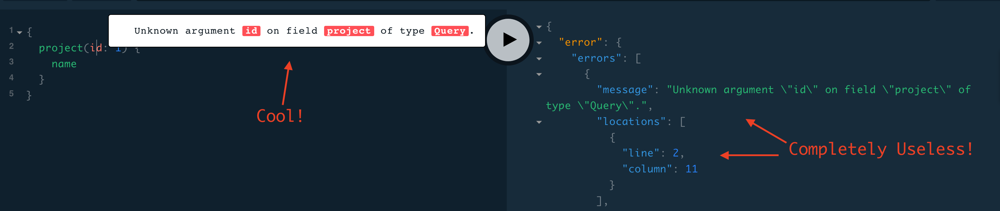

Dealing with the Happy Path™ in an API is pretty easy: When a client asks for a
resource, show them the resource. When they trigger a procedure, let them know
if it was triggered OK, and maybe if it completed without a problem.

What to do when something doesn’t go according to plan? Well, that can be
tricky.

[HTTP status codes](http://http.cat/) are part of the picture, they can define a
category of issue, but they are never going to explain the whole story.

Two examples from a carpooling application which had a "simulated savings"
endpoint, to let folks know how much they might save picking up a passenger on
their daily commute:

This error let the client know the coordinates were too close together, meaning
it is not even worth driving let alone trying to pick anyone else up.

``` http
HTTP/1.1 400 Bad Request

{
  "errors" : [{
    "code"   : 20002,
    "title"  : "There are no savings for this user."
  }]
}
```

This carpool driver is trying to create a trip from Colombia to Paris.

``` http
HTTP/1.1 400 Bad Request

{
  "errors" : [{
    "code"   : 20010,
    "title"  : "Invalid geopoints for possible trip."
  }]
}
```

This is often touted as a failing of the HTTP status code concept, but it was
never intended to cover every single possible application specific error
message. Think of HTTP status codes like an exception. In Ruby you might get a
ArgumentError or LoadError exception which gives you a pretty good hint as to
what the issue is, but there is also data specific to the instance of that
failure that helps with fixing the situation.

Programming languages do not just give you the exception name, they give you
instance information too.

```ruby
> require "nonsense"
LoadError (cannot load such file -- nonsense)
```

Errors in HTTP APIs are pretty similar to exceptions: they can tell the client
what is going on, and combine a bunch of useful metadata to help both the client
and the server solve problems. This is often in the response body, using JSON or
whatever data format the API generally uses.

## Error Objects

A well designed API error will have at the very least:

* A 4xx or 5xx status code depending on the situation

* A human readable short summary: Cannot checkout with an empty shopping cart

* A human readable message: It looks like you have tried to check out but there is nothing in your…​

* An application-specific error code relating to the problem: `ERRCARTEMPTY`

* Links to a documentation page or knowledge base where a client or user of the client can figure out what to do next

This will help humans and machines to figure out what is happening. Missing out
the error code means clients need to implement substring matching, which is
awful for everyone, and turns contents of the error message into part of the
agree contract. Imagine a text-change breaking integration with multiple unknown
clients! 😳

This used to happen with Facebook and their rather bad Graph API, where any
issue with an access token would return type: OAuthException, regardless of the
type of issue. If it was an expired token which needed a refresh, or if it was
just total nonsense, you would get the same type, and a different string.

```javascript
{
  "error": {
    "type": "OAuthException",
    "message": "Session has expired at unix time 1385243766. The current unix time is 1385848532."
  }
}
```

Without getting too much into Authentication at this point, there are times
where the client would want to take different actions for different errors. For
example, when an access token was previously good but expires, the client wants
to suggest the user try logging in again, or reconnecting their Facebook
account. When the token is just nonsense (a totally invalid token) then a
different action needs to be taken.

These days Facebook have a far more robust error object in their Graph API, with
error codes and even "sub-codes", so the client developer has enough information
to react programmatically to various errors.

An improved version of that error message, with an error code and a link

``` javascript
{
  "error": {
    "message": "Message describing the error",
    "type": "OAuthException",
    "code": 190,
    "error_subcode": 460,
    "error_user_title": "A title",
    "error_user_msg": "A message",
    "fbtrace_id": "EJplcsCHuLu"
  }
}
```

They explain the structure of the error object in their documentation.
> - **message:** A human-readable description of the error.
> - **code:** An error code. Common values are listed below, along with common recovery tactics.
> - **error_subcode:** Additional information about the error. Common values are listed below.
> - **error_user_msg:** The message to display to the user. The language of the message is based on the locale of the API request.
> - **error_user_title:** The title of the dialog, if shown. The language of the message is based on the locale of the API request.
> - **fbtrace_id:** Internal support identifier. When reporting a bug related to a Graph API call, include the fbtrace_id to help us find log data for debugging.
>
> —- [Facebook GraphAPI Documentation](https://developers.facebook.com/docs/graph-api/using-graph-api/error-handling)

## Know Your Audience

Making errors be useful for client users (not just client developers) can be a
powerful thing. Clients can build their interface around the expectation that a
link in an error will help their users out, without needing to know specifically
what the actual error is.

Whenever possible try to avoid creating an API error that you would not want to
show to a user. Often a client will create a filter that checks for certain
errors to do something, and anything left can be thrown up as a generic error
box with the message in it.

Clients doing this help future proof their application. For example, if a new
validation rule pops up they might not have their UI code written to check for
that, but an ugly alert box can pop up with instructions to the user and maybe
that is better than the application just being completely unusable.

Another useful thing to do is put a link for more information.

Add a href/link/url property to your error object.

``` javascript
{
  "error": {
    ...
    "href": "http://example.org/docs/errors/#ERR-01234"
  }
}
```

In some instances maybe this more information link points to a blog post or some documentation which explains that the user should update their application, or take some other action to resolve the situation, or email somebody, or reset their password. 👍

## The Trouble with Custom Error Formats

Everyone starts off building APIs with their own error format. It usually starts off as just a string.

``` javascript
{
  "error": "A thing went really wrong"
}
```

Then somebody points out it would be nice to have application codes, and new versions of the API (or some different APIs built in the same architecture) start using a slightly modified format.

``` javascript
{
  "error": {
    "code": "100110",
    "message": "A thing went really wrong"
  }
}
```

Guess what happens when a client is expecting the first example of a single
string, but ends up getting that second example of an object?

![When an error is an object but the client shoves it into a string, you see [object Object] and it happens aaaall the time.](../../images/posts/useful-errors/object-Object.jpg)
_A wild [object Object] appears on Gelato — a discontinued API design and analytics platform acquimerged into Kong._

These errors happened at my previous job all the time, because every one of the
50 APIs had a totally different error format, some had multiple different error
formats in different API versions (v2 and v3 would have different error
formats), and [you would be expected to hit
both!](/blog/api-versioning-has-noright-way)

I remember writing a bunch of code that would check for various properties, if
error is a string, if error is an object, if error is an object containing foo,
if error is an object containing bar…​.

## Standard Error Formats

There are two common standards out there for API errors which you should
consider using for your next API, or maybe even consider adding to your existing
APIs.

### Problem Details for HTTP APIs

[Problem Details for HTTP APIs (RFC 7807)](https://tools.ietf.org/html/rfc7807) is a brilliant standard from Mark Nottingham, Erik Wilde, released through the IETF.
> *This document defines a "problem detail" as a way to carry machine-readable details of errors in a HTTP response to avoid the need to define new error response formats for HTTP APIs.*
> —[ Internet Engineering Task Force (IETF)](https://tools.ietf.org/html/rfc7807)

The goal of this RFC is to give a standard structure for errors in HTTP APIs that use JSON (application/problem+json) or XML (application/problem+xml).

```http
HTTP/1.1 403 Forbidden
Content-Type: application/problem+json
Content-Language: en

{
  "type": "https://example.com/probs/out-of-credit",
  "title": "You do not have enough credit.",
  "detail": "Your current balance is 30, but that costs 50.",
  "instance": "/account/12345/msgs/abc",
  "balance": 30,
  "accounts": ["/account/12345", "/account/67890"]
}
````

This example from the RFC shows the user was forbidden from taking that action, because the balance did not have enough credit. 403 would not have conveyed that (it could have meant the user was banned, or all sorts of things) but there is text, and there is a type, which is just an error code in the form of a URL.
> *Note that this requires each of the sub-problems to be similar enough to use the same HTTP status code. If they do not, the 207 (Multi- Status) [RFC4918] code could be used to encapsulate multiple status messages.*
> *A problem details object can have the following members:*
> - type (string) — A URI reference [RFC3986] that identifies the problem type. This specification encourages that, when dereferenced, it provide human-readable documentation for the problem type (e.g., using HTML [W3C.REC-html5–20141028]). When this member is not present, its value is assumed to be abou:blank".
> - title (string) — A short, human-readable summary of the problem type. It SHOULD NOT change from occurrence to occurrence of the problem, except for purposes of localization (e.g., using proactive content negotiation; see [RFC7231], Section 3.4).
> - status (number) — The HTTP status code ([RFC7231], Section 6) generated by the origin server for this occurrence of the problem.
> - detail (string) — A human-readable explanation specific to this occurrence of the problem.
> - instance (string) — A URI reference that identifies the specific occurrence of the problem. It may or may not yield further information if dereferenced.
>
> -— [Internet Engineering Task Force (IETF)](https://tools.ietf.org/html/rfc7807)

Remembering all of this might be a little tricky, and asking every API developer to go read and memorize an RFC might not be particularly successful. As with most things, there are implementations that can be slotted into place for languages and web application frameworks to make the whole thing easier.

* **PHP:** [zendframework/zend-problem-details](https://github.com/zendframework/zend-problem-details)

* **Java:** [problem](https://github.com/zalando/problem) & [problem-spring-web](https://github.com/zalando/problem-spring-web)

* **Python:** [https://github.com/cbornet/python-httpproblem](https://github.com/cbornet/python-httpproblem)

* **Node:** [https://www.npmjs.com/package/problem-json](https://www.npmjs.com/package/problem-json)

### JSON:API

[JSON:API](http://jsonapi.org/format/#errors) is a standard for a lot more than just errors, it attempts to help with a lot of design choices for HTTP APIs, outlining the general format of requests and responses in JSON when working with HTTP APIs.

In general it labels itself an anti-bikeshedding tool, and this is pretty accurate. HTTP API developers often feel like there are infinite possibilities, which can lead to a lot of discussions and arguments, so using implementations like JSON:API can get folks on the same page.

The following is an excerpt from the JSON:API standard at time of writing.
> *An error object MAY have the following members:*
> - **id** — A unique identifier for this particular occurrence of the problem.
> - **href** — A URI that MAY yield further details about this particular occurrence of the problem.
> - **status** — The HTTP status code applicable to this problem, expressed as a string value.
> - **code** — An application-specific error code, expressed as a string value.
> - **title** — A short, human-readable summary of the problem. It SHOULD NOT change from occurrence to occurrence of the problem, except for purposes of localization.
> - **detail** — A human-readable explanation specific to this occurrence of the problem.
> - **links** — Associated resources, which can be dereferenced from the request document.
> - **path** — The relative path to the relevant attribute within the associated resource(s). Only appropriate for problems that apply to a single resource or type of resource.
>
> -— [JSON:API](https://jsonapi.org/format/#errors)

Pretty familiar stuff here! Whilst RFC 7807 has an interface that suggests one error object be returned with multiple problems provided using extra properties, JSON:API errors are an array of error objects.

``` http
HTTP/1.1 422 Unprocessable Entity
Content-Type: application/vnd.api+json

{
  "errors": [
    {
      "source": { "pointer": "/data/attributes/firstName" },
      "title": "Invalid Attribute",
      "detail": "First name must contain at least three characters."
    },
    {
      "source": { "pointer": "/data/attributes/firstName" },
      "title": "Invalid Attribute",
      "detail": "First name must contain an emoji."
    }
  ]
}
```

That "pointer" is a [JSON Pointer (RFC
6901)](https://tools.ietf.org/html/rfc6901), and can be used to point to the
specific location in the HTTP request body that failed.

This is great for client developers who have a UI. They probably already have
some logic which maps their form inputs to request data, so if they use that
pointer they can trace the error back to a form input, and show custom
validation errors even if they had not built that validation into their
frontend.

_**Note:** Clients love copying validation rules into their applications and
that leads to all sorts of problems. Provide them with an alternative using
[JSON Schema client-side
validation](/blog/the-many-amazing-uses-of-json-schema-client-side-validation)._

There are a lot of [implementations for
JSON:API](https://jsonapi.org/implementations/). To be frank, some are better
than others, by which I mean some are amazing and some are truly terrible. Check
a few out.

## Should You Use a Standard?

RFC 7807 was only released as a final RFC in 2016, and JSON:API is also fairly
recent in the grand schema of the Internet. As such there are not many popular
APIs using them. This is a common stalemate scenario where people do not
implement standards until they see buy-in from a majority of the API community,
or wait for a large company to champion it, and seeing as everyone is waiting
for everyone else to go first nobody does anything. The end result of this
stalemate is that most people roll their own solutions, making a standard less
popular, and the vicious cycle continues.

Many large companies are able to ignore these standards because they can create
their own effective internal standards, and have enough people around with
enough experience to avoid a lot of the common problems around.

Smaller teams that are not in this privileged position, can benefit from
differing to standards written by people who have more context on the task at
hand. If you are Facebook then certainly roll your own error format, but if you
are not then RFC 7807 will point you in the right direction, and implementations
make it easy.

## 200 OK and Error Code

HTTP 4XX or 5XX codes alert the client, monitoring systems, caching systems, and
all sorts of other network components that something bad happened.

*The folks
over at CommitStrip.com know what’s up.*

If you return an HTTP status code of 200 with an error code, then Chuck Norris
will roundhouse your door in, destroy your computer, instantly 35-pass wipe your
backups, cancel your Dropbox account, and block you from GitHub.

It is the hidden error. HTTP-based monitoring systems do not know about your
arbitrary { success : false } conventions and so do not report errors.

HTTP network caching will cache your errors because you are recording them as
not errors.

Do. Not. Use. 200. For. Errors. Ok?!

## GraphQL

GraphQL has an error object format defined, so in theory no choice should need
to go into selecting one. It has a message and a location, the location being
useful for GraphIQL and other visual query tools to help show which line the
error was on.


_Errors seem to be tailored to helping the console show a pretty message, but make it
tough for programmers to do anything useful._

There is also a path property made available in some error responses:

``` javascript
    "path": [
      "name"
    ],
```
At first this may appear to be similar to the JSON:API pointer (JSON Pointer) approach, but is actually considerably more complex.

> If an error can be associated to a particular field in the GraphQL result, it must contain an entry with the key path that details the path of the response field which experienced the error. This allows clients to identify whether a null result is intentional or caused by a runtime error.
>
> This field should be a list of path segments starting at the root of the response and ending with the field associated with the error. Path segments that represent fields should be strings, and path segments that represent list indices should be 0-indexed integers. If the error happens in an aliased field, the path to the error should use the aliased name, since it represents a path in the response, not in the query.
>
> For example, if fetching one of the friends’ names fails in the following query:
>
> ``` javascript
> {
>   hero(episode: $episode) {
>     name
>     heroFriends: friends {
>       id
>       name
>     }
>   }
> }
> ```
>
> The response might look like:
>
> ```javascript
> {
>   "errors": [
>     {
>       "message": "Name for character with ID 1002 could not be fetched.",
>       "locations": [ { "line": 6, "column": 7 } ],
>       "path": [ "hero", "heroFriends", 1, "name" ]
>     }
>   ],
>   "data": {
>     "hero": {
>       "name": "R2-D2",
>       "heroFriends": [
>         {
>           "id": "1000",
>           "name": "Luke Skywalker"
>         },
>         {
>           "id": "1002",
>           "name": null
>         },
>         {
>           "id": "1003",
>           "name": "Leia Organa"
>         }
>       ]
>     }
>   }
> }
> ````
>
> -— Lee Byron, [graphql-spec](https://github.com/graphql/graphql-spec)

As you might have noticed here, GraphQL has an interesting spin on errors. With
most HTTP APIs you are either trying to do something and succeed, or you fail,
and it is usually rather binary.

_**Note: **An exception to that rule might be trying to fetch a collection of
things, searching, etc. and getting an empty result, but that is not an error,
that is a fetch returning an empty result._

GraphQL has a different take, and it tries to provide as much data back even
when a request contained incorrectness. It usually seems more like GraphQL
considers errors to be merely warnings, which is why you can have data and also
have errors, and that not be an issue.

When trying to work out where people should put their own errors, there are a lot of disparate instructions. Some folks saying things like:

> If the viewer should see the error, include the error as a field in the
> response payload. For example, if someone uses an expired invitation token and
> you want to tell them the token expired, your server shouldn’t throw an error
> during resolution. It should return its normal payload that includes the error
> field. It can be as simple as a string or as complicated as you desire:
>
> ``` javascript
> return {
>   error: {
>     id: '123',
>     type: 'expiredToken',
>     subType: 'expiredInvitationToken',
>     message: 'The invitation has expired, please request a new one',
>     title: 'Expired invitation',
>     helpText: 'https://yoursite.co/expired-invitation-token',
>     language: 'en-US'
>   }
> }
> ```
>
> -— [Matt Krick](https://itnext.io/the-definitive-guide-to-handling-graphql-errors-e0c58b52b5e1)

This is back to creating custom error formats, despite GraphQL having one
bundled...

Once again, GraphQL is so vague on a particular topic that it is not very
helpful, and the vendors have to step in. Apollo has extension based [tooling
for errors](https://www.apollographql.com/docs/apollo-server/features/errors)
which can help you, but the usual concerns about vendor lockin, $$$ and having
extension-riddled APIs apply.

## gRPC

gRPC does not care about how you do errors, do what you want. The official
documentation for gRPC Core has written down some [pre-defined error
codes](https://grpc.io/grpc/core/md_doc_statuscodes.html), but you can invent
your own too.

The official documentation pushes readers towards
[http://avi.im/grpc-errors/](http://avi.im/grpc-errors/), which is a convenient
set of SDKs for most of the programming languages gRPC is implemented in. The
code helps API developers use the status codes defined in gRPC Core, and add
their own text too.

_All this and more in **[Build APIs You Won't Hate: Second
Edition](https://leanpub.com/build-apis-you-wont-hate-2/)**, currently available
for pre-order with the early chapters available for download._
