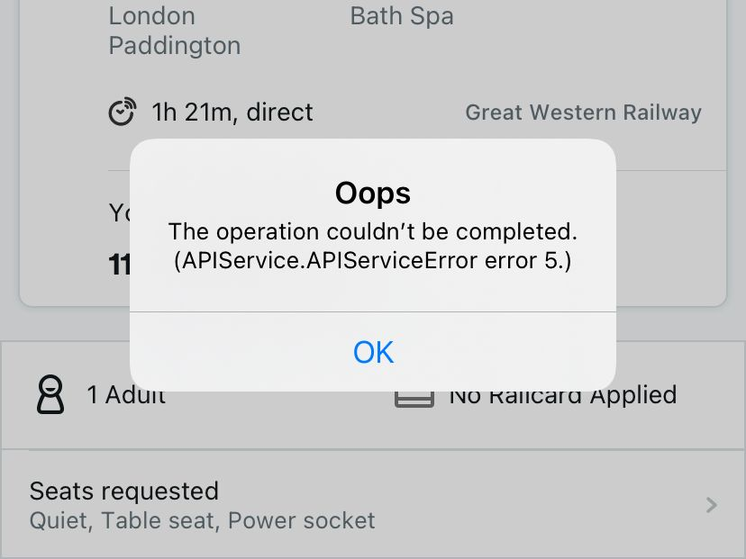
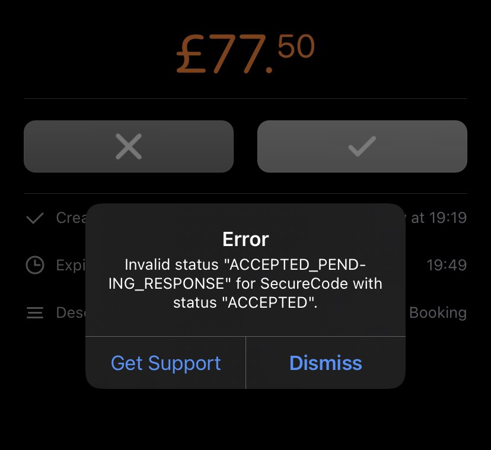
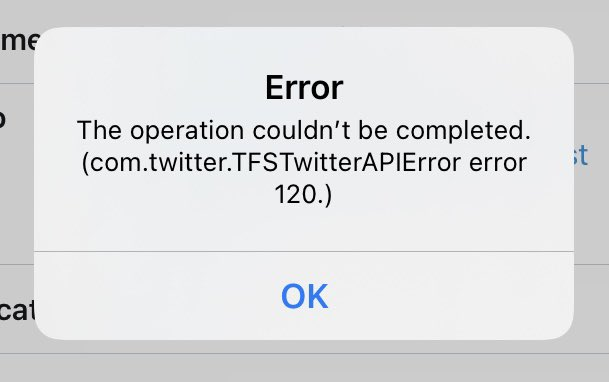
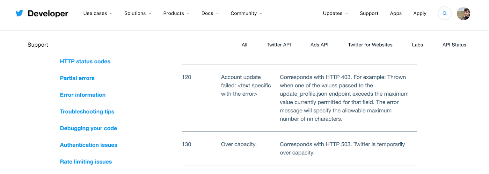

Making a call over the network is inherently unreliable. A million things can go wrong when an API client talks to an API: the connection could fail on the device half way through the transaction, the server could run out of RAM, the request could time out, an automatic retry might trigger a weird validation message for something that actually worked fine but failed on the retry and now is in a conflict state, or maybe the API developers pushed a breaking change without telling the clients and now the client cannot comprehend the current state.

When things go wrong, what do you do? Do you vomit random API error codes and exception class names all over your end users screens, pointlessly confusing the hell out of them? Probably!

<figure>
  
  <figcaption>Trainline barfed this error message at me when I was trying to book a train ticket from London to Bath.</figcaption>
</figure>

"Oops" ok cute. An error has happened. What went wrong. 

"This operation could not be completed." Thank you yes that was clear from the Oops but good to be explicit at least.

"APIService.APIServiceError" Yes ok I see the word error in there I am aware there was an error, but what does that tell me that wasn't covered with "Oops" and "This operation could not be completed."

Finally "error 5" That clears it up perfectly! 🙃

I'm sure that means something to somebody, but it doesn’t mean anything to me. I'm just trying to buy a train ticket, and this doesn't give me any information I can use to change the outcome. Should I try again? Should I give up trying to use the app? Should I phone customer support to try and get a ticket? Has the train been cancelled?! 

Tell users something relevant, or don't tell them anything. If there was a network error, the Trainline app could have said "There’s a problem with your connection, please check your connection settings." If there was a 500-599 error the application could have said "Sorry, our servers are struggling. Please try again in a few minutes, or call customer support on 555-555-5555."

<figure>
  
  <figcaption>My bank is shouting at me while I try to book a hotel room.</figcaption>
</figure>

Bunq, [the tree-planting Dutch bank](https://www.bunq.com/benefits/trees), started shouting at me today. It seemed like my first attempt to approve a payment failed with no UI update. So I clicked approve again, and it hurled these CONSTANTS at me, which if I was NON_TECHNICAL would be SUPER_CONFUSING! I guess the server had approved the payment but not told the client somehow, and now I'm stuck out of state, getting moaned at because it didn't like being accepted a second time

There's two main problems here:

1. On the client-side, it's weird that they are displaying errors suggesting status is invalid. This makes it look like Bunq doesn't know how Bunq works. Why would an end user ever want to see this? If I am sending ACCEPTED_PENDING_RESPONSE to a resource that has ACCEPTED, the human equivalent of that is "This payment was already accepted." so why not say that. instead of spitting out constants and leaking implementation details to the users eyeballs?

2. On the backend, their API could make life a lot easier for the client by using "idempotency keys" ([like Stripe do for example](](https://stripe.com/docs/api/idempotent_requests))). If they had assigned a `Idempotency-Key` value of `PHILTUES123MONKEYS` and I approved that request, when it failed to update the UI for whatever reason and I tried again, I would be making a second request with that same idempotency key. This would let the API know that instead of shouting "AGHHHH YOU CANNOT DO THAT, 409 Conflict, bad status, BLARP!" that it could instead say "You got it, job done!" even if it had already been done. 

Either way, the client and API are failing to let the user do what they want to do: all I want is to mark that payment as accepted, so I can stop standing in the rain and check into my hotel. If it's already been accepted then happy days, we're out of here, move that UI along. 

<figure>
  
  <figcaption>Twitter slapped <a href="https://twitter.com/alexjgarrett">Alex Garrett-Smith</a> with this nonsense whilst trying to update their bio.</figcaption>
</figure>

This looks incredibly similar to the Trainline error. It's probably a default in some common iOS HTTP library. Again, we've got ourselves an utterly useless exception class name, and it's not even saying com.twitter.ClientError, just "Somefing dur brok3n!". Then yep, a random "Error 120". This is not a HTTP status code, but something Twitter specific in the JSON body of an error.

<figure>
  
  <figcaption>Twitter explain this random API error code to developers but not to users of their mobile app.</figcaption>
</figure>

What is slightly more infuriating about this one, is that Twitter have gone to the effort of [documenting this error code](https://developer.twitter.com/en/support/twitter-api/error-troubleshooting) on Twitter Developers, but their iOS team didn't fancy implementing a quick check for code 120?

```js
switch error.code {
case "120":
  alert(
    "These changes are not valid, why did our client" + 
    "application let you get this far, we are as " + 
    "confused as you are, and we have contacted the " + 
    "engineering team to improve their client-side " + 
    "validation. Sorry for wasting your time."
  })
case "130":
  alert(
    "Twitter servers are absolutely melting right now. " + 
    "Take a break. Go outside. Seize the day!"
  )
case "323":
  alert("Only one animated GIF may be attached to a single Tweet.")
default:
  if (error instanceof NetworkError) {
    alert("Please check your internet connection.")
  } else {
    alert(
      "Something wild has gone wrong. We have " +
      "automatically reported this error to the engineers."
    )
    sendErrorToRollbar(error);
  }
}
```

All client applications should have code like this. Every single one. Bake it into your SDKs as middleware, to kick off after your [auto-retry logic and circuit breakers](https://apisyouwonthate.com/blog/taking-a-timeout-from-poor-performance) have done their job. This lets you decide which known errors to send to error reporting software like Rollbar, BugSnag, Sentry, etc. and which would be a massive waste of time to report. Oh, did Gary just get a 404 trying to get page 2347 from the website when he meant to type 234? Who cares.

Most importantly, why is documentation telling me more than what the end user is seeing? It's maddening. Nobody cares about your API, they just want to use the software to do the thing they're trying to do.

## High Quality API Errors

API clients cannot work with what they don't have, so API developers should always try to explain what has gone wrong. We've written about [creating high quality API errors](https://apisyouwonthate.com/blog/creating-good-api-errors-in-rest-graphql-and-grpc) for humans and computers in the past, and the short version is: use [RFC 7807](https://tools.ietf.org/html/rfc7807), or maybe leverage [JSON:API Errors](https://jsonapi.org/examples/#error-objects) properly if you're already using JSON:API.

Something like RFC 7807 is absolutely brilliant, because not only does it suggest you write a useful error message for humans, but it allows other metadata to be provided which mean API clients can provide all sorts of useful information, by knowing that `https://example.com/probs/out-of-credit` is going to have a `balance` property.

```http
HTTP/1.1 403 Forbidden
Content-Type: application/problem+json
Content-Language: en

{
  "type": "https://example.com/probs/out-of-credit",
  "title": "You do not have enough credit.",
  "detail": "Your current balance is 30, but that costs 50.",
  "instance": "/account/12345/msgs/abc",
  "balance": 30,
  "accounts": ["/account/12345", "/account/67890"]
}
```

If the API only needs to serve English speakers, then maybe that `detail` can be shoved straight out to the client. If suddenly there is a need for i18n, maybe that can be supported on the API side with `Accept-Lang: fr`, or maybe the client can write their own messages for `https://example.com/probs/out-of-credit` and plop the variables in.

There are a lot of ways to make good error messages show up to the end-user, with some trade-offs around simplicity vs cusstomizability, but don't just barf exceptions at your users like they know how to read code and fancy googling your API error codes. That's just rude. 
